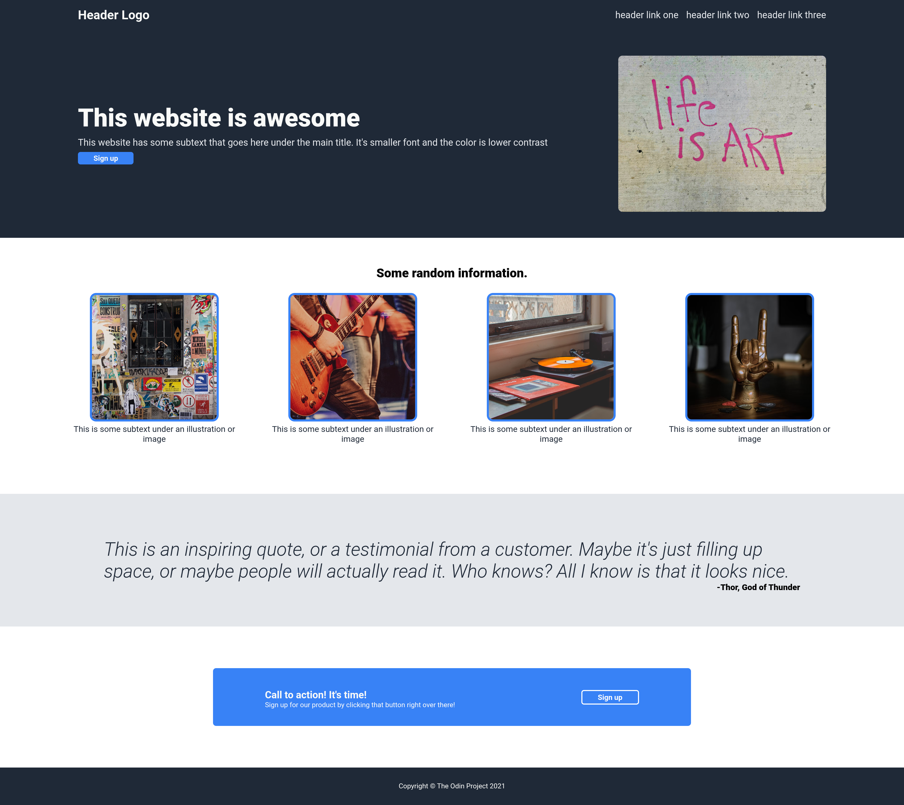
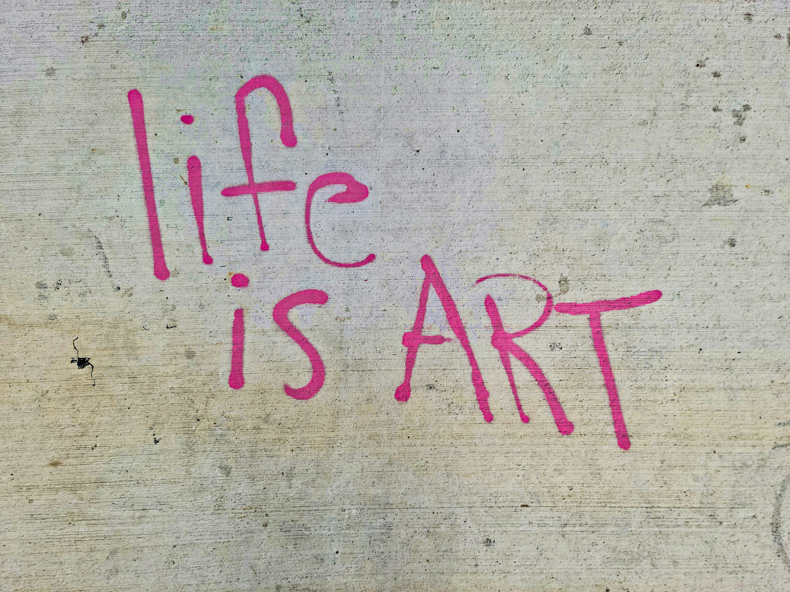

# Landing Page

A landing page built as part of The Odin Project
curriculum.

This project is a personal exercise to refresh and improve my front-end development skills, particularly HTML and CSS. I built the page from scratch based on the design requirements provided by The Odin Project, while making my own choices regarding the images and visual content.

# Preview

# What I Practiced

- Semantic HTML
- CSS box model
- Spacing, sizing, and alignment
- Using Git and GitHub for version control
- HTML5
- CSS3
- Flexbox

# Credits

This project uses photographs from Unsplash. Full credit goes to the original photographers:

George Pagan III

Maurício Guardiano

andre mosele

Travis Yewell

Scott Gummerson

All photographs belong to their respective creators. They are used here for educational purposes as part of a personal learning project. All can be found in the Unsplash platform.

# Purpose

This project is part of my effort to rebuild and modernize my front-end development skills after spending some time away from web development.

Rather than simply following a tutorial, I used the project to practice building the layout independently and to get more comfortable with CSS and Flexbox again.